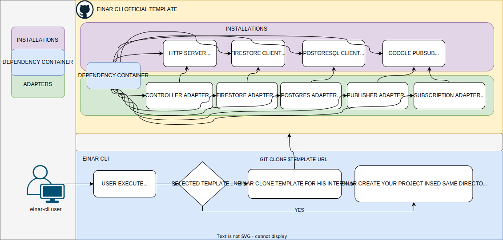
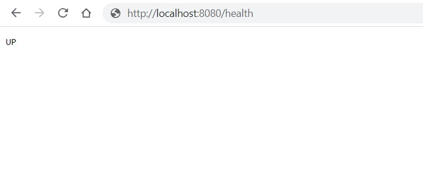

# :fire:EinarCLI: Accelerate Your Application Development:fire:

EinarCLI is a blazingly fast :fire: and powerful command-line interface tool designed to supercharge :rocket: your application development process. It helps to streamline and expedite the creation of your applications, enabling you to code faster, smoother, and smarter.

With EinarCLI, get ready to turn up the heat :fire: on your programming skills and develop applications like never before!

## Minimum Requirements

- [Golang 1.20](https://golang.org/doc/install)

## 🔧 Installation
To install EinarCLI, use the following command:

    go install github.com/Ignaciojeria/einar@v1.19.0

To verify your EinarCLI installation, run:

    einar version

## :computer: Usage
#### Starting a new Einar project with the official template

To use the official EinarCLI template for creating a new project, execute the following command:

    einar init my-project-name https://github.com/Ignaciojeria/einar-cli-template no-auth
    
#### Starting a new Einar project with your custom private template
If you wish to utilize your own corporate private template to initiate a new project, use the following command:

    einar init my-project-name https://github.com/your-corporative-private-einar-cli-template user:token

## 🌐  Installing HTTP Server
We are using Echo to manage HTTP requests efficiently. To install the Echo Server, run the following command in your terminal:

    einar install echo-server
    
#### 🔍 Check Application Port 
To check the port that your HTTP server is using for your application, you can refer to the .env file located in the root directory of your Einar project:

``` .env
# THIS IS REFERENCE FILE OF YOUR ENVIRONMENT VARIABLES
# DONT STORE YOUR ENVIRONMENT VARIABLES ON YOUR REPOSITORY!
PORT = "8080"
COUNTRY = "CL"
SERVICE = "my-project-name"
ENV = "local"
```


#### 🔍 Run Application
To run the application, you can start it as a traditional Golang application by executing the following command:

    go run main.go

This will start your application on the default port specified in the configuration.

#### 🔍 Check Running Application Status
To check the status of the running application, visit the following URL in your web browser:

[http://localhost:8080/health](http://localhost:8080/health) 



## :hammer: HTTP Server - Inbound Adapter
An HTTP Inbound Adapter is the same as a controller in a web application. To create a new HTTP inbound adapter, we need to execute the following commands:

    einar generate get-controller  get-customer
    einar generate post-controller post-customer
    einar generate put-controller put-customer
    einar generate patch-controller patch-customer
    einar generate delete-controller delete-customer

####  🔍 Directory Structure
When running the Einar commands to generate controllers, the following directory structure will be created in your project:

```bash
/app
  /adapter
    /in
      /controller
        - get_customer.go   # Generated with 'einar generate get-controller get-customer'
        - post_customer.go  # Generated with 'einar generate post-controller post-customer'
        - put_customer.go  # Generated with 'einar generate put-controller put-customer'
        - patch_customer.go # Generated with 'einar generate patch-controller patch-customer'
        - delete_customer.go # Generated with 'einar generate delete-controller delete-customer'
```

#### 🔍 File structure
For example, when you generate a controller using the `einar generate get-controller get-customer` command, Einar CLI will create a new .go file with the following structure:

```go
package controller

func init() {
	container.InjectInboundAdapter(func() error {
		einar.Echo.GET("/INSERT_YOUR_PATTERN_HERE", getCustomer)
		return nil
	}, container.InjectionProps{
		DependencyID: uuid.NewString(),
	})
}

func getCustomer(c echo.Context) error {
	//PUT HERE YOUR HANDLING PROCESS
	return c.JSON(http.StatusOK, "INSERT_YOUR_CUSTOM_RESPONSE")
}
```
In the generated controller template:

- `"/INSERT_YOUR_PATTERN_HERE"` is a placeholder for your route pattern. Replace this with the actual endpoint pattern for your route (for example, `"/customer"` for a route that handles customer data).

- `getCustomer` is the function that handles the route. It currently includes a placeholder comment, `//PUT HERE YOUR HANDLING PROCESS`. Replace this comment with the actual logic that should be executed when a request is made to this route.

- `"INSERT_YOUR_CUSTOM_RESPONSE"` is a placeholder for the response that your route will return. Replace this with the actual response that you want to send back to the client.

Remember to adjust these placeholders according to your project's needs.

For more information on the Echo framework, visit the [Echo documentation](https://echo.labstack.com/).

## 📡 Installing Google PubSub
 To install PubSub Client, run the following command in your terminal:

	einar install pubsub

#### 🔍 Check Pubsub Configuration
After installing Pub/Sub, when you run the application, it will ask you for valid Google application credentials and project ID to start working with Google Pub/Sub.

Make sure to allocate the following configuration in the .env file located at the root of your project:

``` .env
#ENABLE FOR PUBSUB OR FIRESTORE ARCHETYPE INSTALLATION
GOOGLE_PROJECT_ID = "secret"
GOOGLE_APPLICATION_CRETENTIALS_B64 = "base64_secret"
```

## :hammer: Google PubSub - Inbound Adapter
Creating a new Google PubSub Inbound Adapter, in our case, involves generating a pull subscription to a topic. This can be done by executing the following command:

	einar generate subscription pull-customer-created

####  🔍 Directory Structure

```bash
/app
  /adapter
    /in
      /subscription
	- pull_customer_created.go # Generated with 'einar generate subscription pull-customer-created'
```

#### 🔍 File structure
For example, when you generate a subscription using the `einar generate subscription pull-customer-created` command, Einar CLI will create a new .go file with the following structure:

```go
package subscription

var pull_customer_created_stop bool = false

type pullCustomerCreated struct {
	subscriptionName string
}
// DEFAULT CONSTRUCTOR
func PullCustomerCreated(
	r subscription.Receive,
	subscriptionName string) (pullCustomerCreated, error) {
	if pull_customer_created_stop {
		return pullCustomerCreated{}, nil
	}
	s := pullCustomerCreated{
		subscriptionName: subscriptionName,
	}
	ctx := context.Background()
	if err := r(ctx, subscription.Middleware(subscriptionName, s.receive)); err != nil {
		log.
			Error().
			Err(err).
			Str(constants.SUBSCRIPTION_NAME, subscriptionName).
			Msg(constants.SUSBCRIPTION_SIGNAL_BROKEN)
		time.Sleep(10 * time.Second)
		go PullCustomerCreated(r, subscriptionName)
		return s, err
	}
	return s, nil
}
 // DEFAULT SUBSCRIPTION CONFIGURATION SETUP
func init() {
	const subscription_name = "INSERT YOUR SUBSCRIPTION NAME"
	container.InjectInboundAdapter(func() error {
		subscription_setup := einar.Client.Subscription(subscription_name)
		subscription_setup.ReceiveSettings.Synchronous = true
		subscription_setup.ReceiveSettings.NumGoroutines = 1
		subscription_setup.ReceiveSettings.MaxOutstandingMessages = 1
		go PullCustomerCreated(subscription_setup.Receive, subscription_name)
		return nil
	}, container.InjectionProps{
		DependencyID: uuid.NewString(),
	})
}

func (s pullCustomerCreated) receive(ctx context.Context, m *pubsub.Message) {
	s.processMessage(ctx, m)
}

func (s pullCustomerCreated) processMessage(ctx context.Context, m *pubsub.Message) error {

	//PUT HERE YOUR SUBSCRIPTION PROCESS

	var replace_by_your_model interface{}
	err := json.Unmarshal(m.Data, &replace_by_your_model)

	if err != nil {
		log.
			Error().
			Str(constants.SUBSCRIPTION_NAME, s.subscriptionName).
			Err(err).
			Msg("error unmarshaling m.Data")
		m.Ack()
		return err
	}
	m.Ack()
	return nil
}

```

## :hammer: Google PubSub - Outbound Adapter
Creating a new Google PubSub Outbound Adapter, in our case, involves generating a publisher that sends messages to a Google Cloud topic. This can be done by executing the following command:

	einar generate publisher publish-customer

####  🔍 Directory Structure

```bash
/app
  /domain
    /ports
      /out
	- publish_customer.go # Generated with 'einar generate publisher publish-customer'
```

```bash
/app
  /adapter
    /out
      /publisher
	- publish_customer.go # Generated with 'einar generate publisher publish-customer'
```

#### 🔍 File structure
For example, when you generate a publisher using the `einar generate publisher publish-customer` command, Einar CLI will create a new .go files with the following structure:

```go
package out

type PublishCustomer func(ctx context.Context, REPLACE_BY_YOUR_DOMAIN map[string]string) error

```

```go
package pubsub

var publishCustomerTopic *pubsub.Topic

func init() {
	container.InjectOutboundAdapter(func() error {
		publishCustomerTopic = einar.Client.Topic("INSERT YOUR TOPIC NAME HERE")
		return nil
	}, container.InjectionProps{
		DependencyID: uuid.NewString(),
	})
}

var PublishCustomer out.PublishCustomer = func(ctx context.Context, REPLACE_BY_YOUR_DOMAIN map[string]string) error {

	bytes, err := json.Marshal(REPLACE_BY_YOUR_DOMAIN)
	if err != nil {
		fmt.Println("Error:", err)
		return err
	}

	message := &pubsub.Message{
		Attributes: map[string]string{
			"customAttribute1": "attr1",
			"customAttribute2": "attr2",
		},
		Data: bytes,
	}

	result := publishCustomerTopic.Publish(ctx, message)

	// Get the server-generated message ID.
	messageID, err := result.Get(ctx)
	if err != nil {
		// Handle the error
		fmt.Println("Error occurred while publishing the result:", err.Error())
		// Perform any necessary error handling actions
		return err
	}

	// Successful publishing
	fmt.Println("Message published with ID:", messageID)
	return nil
}
```

## 🔥 Installing Google Firestore
To install Firestore Client, run the following command in your terminal:

	einar install firestore

#### 🔍 Check Firestore Configuration
After installing Firestore, when you run the application, it will ask you for valid Google application credentials and project ID to start working with Firestore.

Make sure to allocate the following configuration in the .env file located at the root of your project:

``` .env
#ENABLE FOR PUBSUB OR FIRESTORE ARCHETYPE INSTALLATION
GOOGLE_PROJECT_ID = "secret"
GOOGLE_APPLICATION_CRETENTIALS_B64 = "base64_secret"
```

## :hammer: Google Firestore - Outbound Adapter
Creating a new Google Firestore Outbound Adapter, in our case, involves generating a repository that does database operations to a specific firestore collection. This can be done by executing the following command:

	einar generate firestore-repository save-customer

####  🔍 Directory Structure

```bash
/app
  /domain
    /ports
      /out
	- save_customer.go # Generated with 'einar generate firestore-repository save-customer'
```

```bash
/app
  /adapter
    /out
      /firestore
	- save_customer.go # Generated with 'einar generate firestore-repository save-customer'
```

#### 🔍 File structure
For example, when you generate a repository using the `einar generate firestore-repository save-customer` command, Einar CLI will create a new .go files with the following structure:

```go
package out

type SaveCustomer func(ctx context.Context, REPLACE_BY_YOUR_DOMAIN map[string]string) error

```

```go
package firestore

import (
	"archetype/app/domain/ports/out"
	einar "archetype/app/shared/archetype/firestore"
	"context"

	"cloud.google.com/go/firestore"
)

var SaveCustomer out.SaveCustomer = func(ctx context.Context, REPLACE_BY_YOUR_DOMAIN map[string]string) error {
	// einar.Client.Collection() returns an instance of Firestore's CollectionReference type.
	// For more details, please consult the documentation here: https://firebase.google.com/docs/firestore/quickstart?hl=es-419#go
	var _ *firestore.CollectionRef = einar.Client.Collection("INSERT_YOUR_COLLECTION_CONSTANTS_HERE")
	return nil
}
```


## ⭐ Features

🔧 **Core Concepts**:
   - No Hidden Dependencies: Ensures transparency in the code dependencies.
   - Dependency Container: Manages object instances and dependencies.
   - Inversion of Control: Decouples modules and promotes code flexibility.

📡 **Google PubSub Integration**:
   - Client Installation & Setup: Streamlines the setup process for Google PubSub.
   - Subscriptions Generation: Easily generate subscriptions.
   - Battle-tested automatic pull subscription reinitialization when the signal is broken.
   - Publishers Generation: Quickly set up publishers for message distribution.

🌐 **Echo Server Integration**:
   - Echo Server Installation: Simplifies the installation process of the Echo Server.
   - Controllers Generation: Generates controllers for handling HTTP requests.

🔥 **Google Firestore Integration**:
   - Firestore Installation & Setup: Streamlines Firestore database setup.
   - Repositories Generation: Quickly generate repositories.

👨‍💻 **Code Ownership and Control**:
   - Full Control of Generated Code: You have complete control over the code that is generated.
   - Code Ownership: The generated code is yours to keep and use as you wish.


## :telephone_receiver: Support

(Contact and support information here)

## :handshake: Contributing

(Contribution guidelines here)
